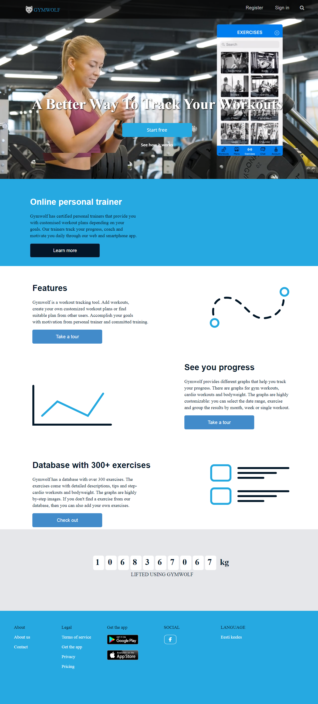
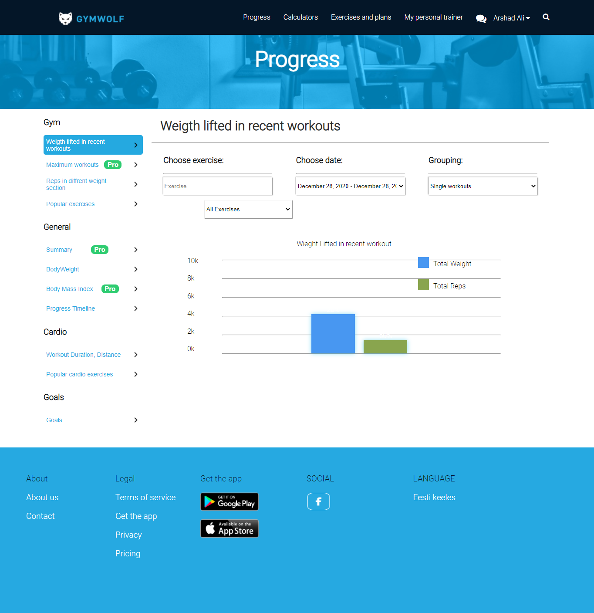
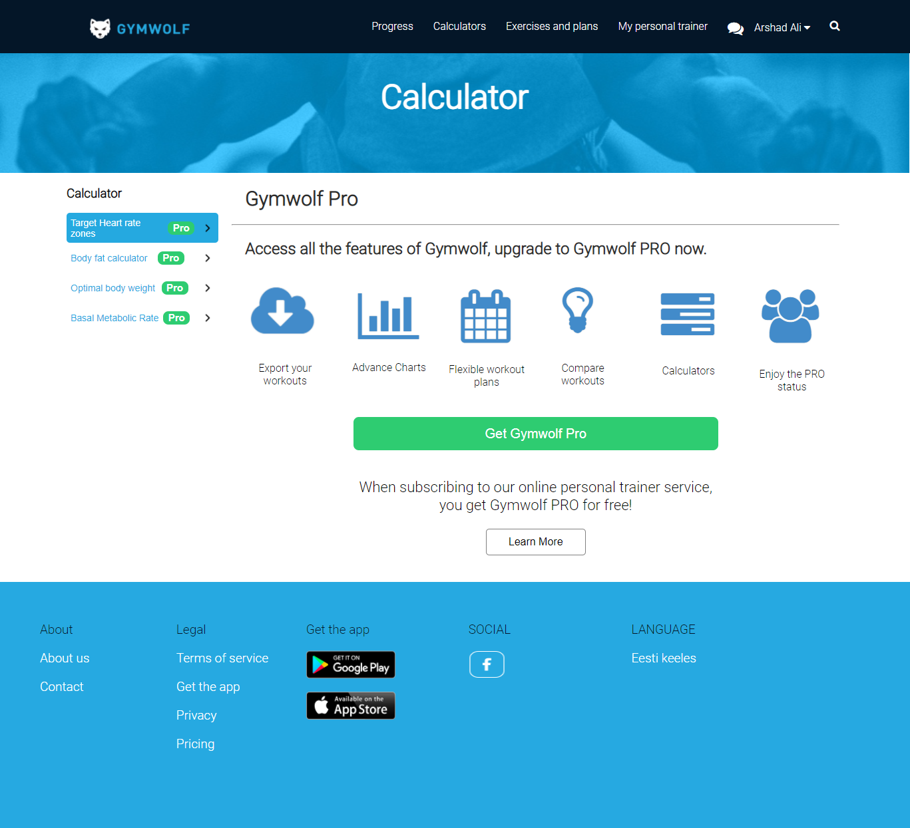
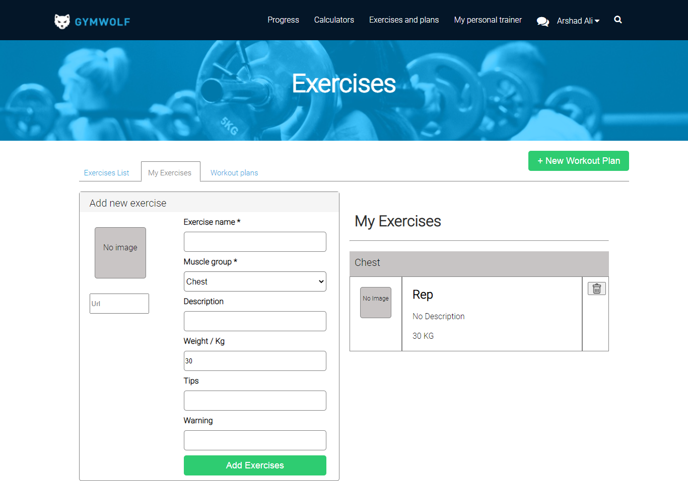
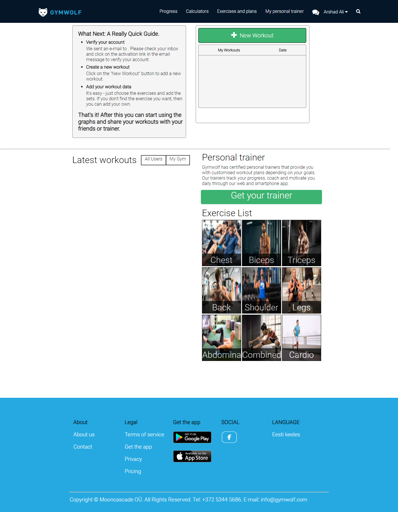

# Potassium

Our team name is ‘Potassium’ which consists of 3 team members:

- Arshad Ali
- Chirag Agarwal
- Sahil Sachdev

# Project Detail:

Cloned User Interface of some pages of a Website : www.gymwolf.com

# Technologies used:

- HTML
- CSS
- JavaScript

# Following pages of the website are cloned:

- Homepage
- ‘Progress’ Page
- Calculator Page
- Exercise and Plane Page
- Main Page Page
- and, 4 Category Pages (In Progress page and main Page dynamically using JavaScript)

# 1. Homepage Page: with embidded video

Features:

- Implemented login PopUp Using JavaScript

# 2. ‘Progress’ Page: With embedded graph functionality .

- Implemented Graph Using JavaScript
- Graph will show the data by geting data from localStorage.

# 3. Calculator Page:

# 4. Exercise and Plane Page:

- Implemented Data add delete Using JavaScript
- This page data is Post on localStorage.
- By the data of this page graph will generate graph.

# 5. Main Page Page Page:

- Implemented Data add Using JavaScript
- This page Show the list of user by clicking on user button.
  
